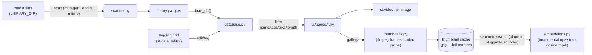

# Architecture

Single-language Python app: a Streamlit UI on top of a parquet metadata database.
Logic lives in an importable package (`src/library_of_mess`), Streamlit glue is
confined to the `ui/` subpackage.

## Data flow

Multipage discovery works because `pages/` sits next to `app.py` (numbering
controls sidebar order); run with `make run` →
`uv run streamlit run src/library_of_mess/ui/app.py`.

## Database schema

Parquet file (despite the historical `.db` name), one row per video:

| column     | type       | editable | notes                          |
|------------|------------|----------|--------------------------------|
| path       | str        | no       | library-relative path, primary key |
| name       | str        | no       | file stem                      |
| length     | float      | no       | seconds, from mutagen          |
| datetime   | datetime64 | auto     | file mtime, backfillable       |
| tags       | str        | yes      | free-form, comma separated     |
| year       | str        | yes      | manual                         |
| bike       | bool       | yes      | domain tag                     |
| hyperlapse | bool       | yes      | domain tag                     |

Schema lives in `scanner.DB_COLUMNS`; missing columns are detected at load and
can be backfilled from the Manage DB page. Legacy absolute (docker-era) paths
are migrated to library-relative ones on first load.

## Configuration

| env var          | default               | set by docker-compose to |
|------------------|-----------------------|--------------------------|
| `LIBRARY_DIR`    | `./library`           | `/library` (ro mount)    |
| `LIBRARY_DB`     | `./library.parquet`   | `/data/library.parquet`  |
| `THUMBNAILS_DIR` | `./.cache/thumbnails` | `/data/thumbs`           |
| `EMBEDDINGS_PATH` | `./.cache/embeddings.npz` | —                    |
| `THUMBNAIL_WORKERS` | `4`                   | (host only) parallel ffmpeg |

Paths are resolved inside functions, never at import time — this is what lets
tests redirect everything into pytest tmp dirs. The same mechanism powers the
isolated demo playground: `make demo` runs everything under `.cache/demo/`
with its own library, db and caches, so real data is never touched.

## Test isolation

`tests/conftest.py` installs an autouse fixture that chdirs into `tmp_path`
and points every config var (library, db, thumbnails, embeddings) there. The
real database is unreachable from tests even if code tries to touch it; UI
pages are smoke-tested headlessly via `streamlit.testing.v1.AppTest`.
Thumbnail tests need an ffmpeg binary and skip otherwise (CI installs one).

## Demo data

`scripts/make_demo_data.py` generates tiny lavfi-based mp4 clips and scans
them through the normal pipeline. Both entry points run inside the isolated
playground: `make demo` (generate + UI) and `make demo-data`
(generate only), under `DEMO_DIR` (default `.cache/demo`, override with
`make demo DEMO_DIR=/somewhere`). The script refuses to overwrite an existing
database unless `FORCE=1`. Needs the ffmpeg binary; the scan step
is the exact code a real rescan runs.
