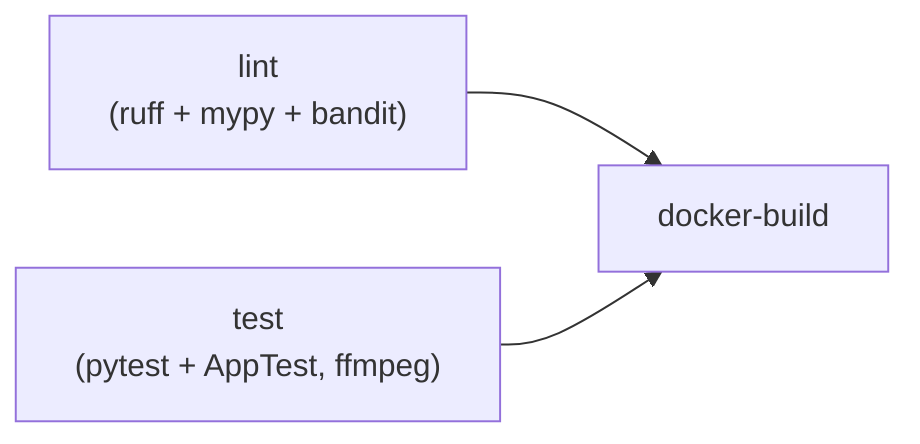

# CI pipeline

GitHub Actions workflow: [.github/workflows/ci.yml](../.github/workflows/ci.yml)

## Job graph



- **lint** — ruff (lint+format) + mypy (strict-ish) + bandit over `src` and
  `tests`, via `make lint`
- **test** — pytest unit tests + per-page streamlit AppTest smoke tests;
  ffmpeg installed so thumbnail tests actually run
- **docker-build** — builds the runtime image after both gates are green

All jobs use uv (`astral-sh/setup-uv`) with `uv sync --group dev`; the
lockfile pins everything. Concurrency group cancels superseded runs on the
same ref.

## Local reproduction

```bash
uv sync --group dev
make lint && make test
docker build -t library_of_mess .
```

Badge (enable after first push to GitHub):

```markdown
[](https://github.com/panjacek/library_of_mess/actions/workflows/ci.yml)
```
